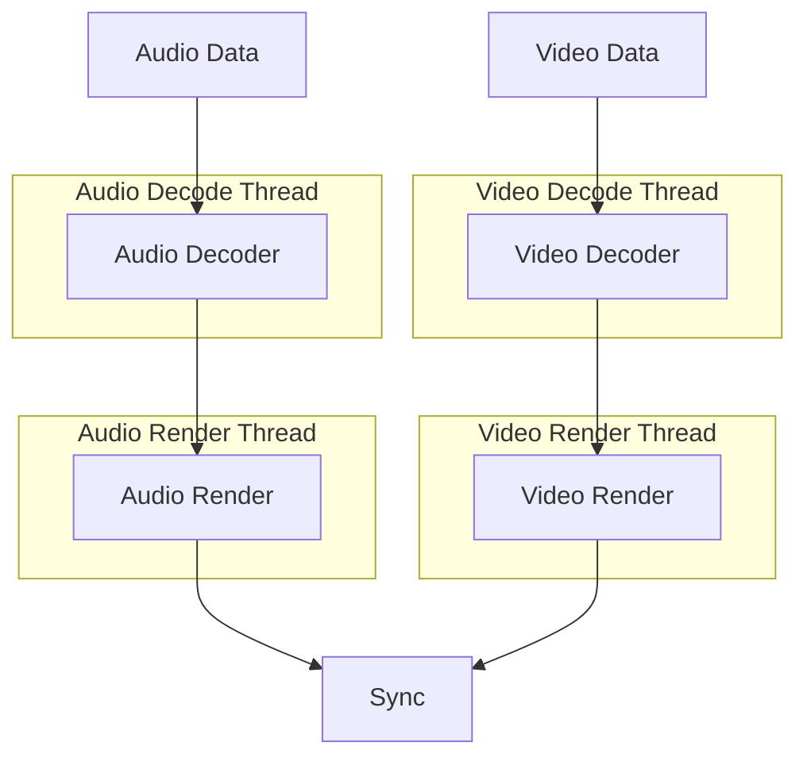

# AV_Render

`AV_Render` is a lightweight player designed for **audio and video playback**.  
It primarily follows a **push-based playback model**:  

- The user provides stream information.  
- The user pushes encoded stream data into `av_render`.  
- The player selects the appropriate codec and decodes the stream.  
- The decoded output is synchronized (if enabled) and then rendered (e.g., audio via I2S, video via LCD).  

---

## 🔹 Architecture

`av_render` processes audio and video in **parallel pipelines** with separate decode and render threads.  
A synchronization module ensures correct playback alignment based on the selected `sync_mode`.  


- **Decode Thread**: Handles audio and video decoding.  
- **Render Thread**: Fetches decoded frames, applies sync control, and renders them.  

### Sync Modes
- **None** → Audio and video run independently.  
- **Audio** → Video is synced to the audio clock.  
- **Time** → Both streams follow system time or timestamps.  

---

## 🔹 Abstraction

### Render Implementations

`av_render` provides abstraction for audio and video rendering.  
Users can choose from the default implementations or develop their own:

- **Audio Rendering** → `av_render_alloc_i2s_render` (outputs audio through I2S)  
- **Video Rendering** → `av_render_alloc_lcd_render` (renders video through `esp_lcd`)  

---

## 🔹 Usage Guide

A typical playback sequence looks like this:

1. `av_render_open`  
2. `av_render_add_audio_stream`  
3. `av_render_add_video_stream`  
4. `av_render_add_audio_data`  
5. `av_render_add_video_data`  
6. `av_render_close`  

### Resetting Playback
To clear the current stream and start fresh, call:  
```c
av_render_reset();
```

---

## 🔹 Resource Configuration

`av_render` offers flexible resource management, including:  
- Decoder render threading options (if fifo not set no threading)  
- Buffer sizes for both audio and video(decode fifo, render fifo etc)  

With this design user can achive trade off between resource consume and performance.  
Configuration is done via `av_render_cfg_t` or through specific APIs:

- `av_render_config_audio_fifo` — Configure audio buffer size  
- `av_render_config_video_fifo` — Configure video buffer size  

---

## 🔹 Decoder Registration

Decoding in `av_render` is powered by `esp_audio_codec` and `esp_video_codec`.  
Only registered decoders are included, ensuring a smaller final image size.  

You can register decoders in two ways:

### 1. Manual Registration
```c
#include "esp_aac_dec.h"
#include "esp_video_dec_h264.h"

esp_aac_dec_register();
esp_video_dec_register_sw_h264();
```

### 2. Register All Defaults (and disable unused ones in `menuconfig`)
```c
#include "esp_audio_dec_default.h"
#include "esp_video_dec_default.h"

esp_audio_dec_register_default();
esp_video_dec_register_default();
```

---

## 🔹 Customization

### Custom Decoders
Users may replace existing decoders or add new ones.  
See the `esp_audio_codec` and `esp_video_codec` documentation for details.

### Custom Renderers
Both audio and video renderers are abstracted as:  
- `audio_render_ops_t`  
- `video_render_ops_t`  

To implement custom renderers, use the existing implementations as references:  
- [i2s_render](render_impl/i2s_render.c)  
- [lcd_render](render_impl/lcd_render.c)  

---

## 📬 Contact & Support

This component is part of the [esp-webrtc-solution](https://github.com/espressif/esp-webrtc-solution), which provides:  
- Complete WebRTC functionality  
- Media handling (`esp_capture`, `av_render`)  
- Multiple signaling methods (OpenAI, WHIP, AppRTC, etc.)  
- Practical examples for real applications  

🔧 **Bug reports or feature requests?**  
Please open an issue here: [esp-webrtc-solution/issues](https://github.com/espressif/esp-webrtc-solution/issues)  

We’re happy to help!  

