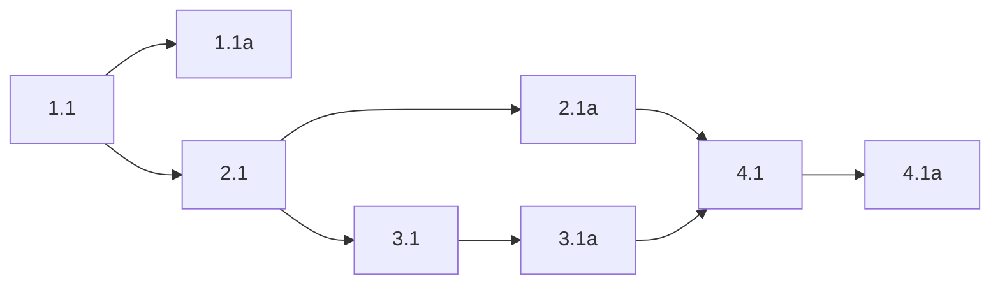

## 1. MQTT command routing
- [x] 1.1 Extend the Theo device command parser in `main/connectivity/mqtt_dataplane.c` to recognize `radar_calibrate` and forward the request into the radar subsystem without embedding calibration policy in the dataplane.
- [x] 1.1a Validate command routing by building the firmware and confirming the new command path compiles cleanly with the existing MQTT command handlers.

## 2. Radar calibration launch API
- [x] 2.1 Add a radar-owned calibration entrypoint in `main/sensors/radar_presence.{c,h}` that checks preconditions, snapshots current parameters when available, starts `ld2410_auto_thresholds(..., 10)`, and emits launch-only logs with truthful wording.
- [x] 2.1a Validate radar calibration launch behavior by triggering `radar_calibrate` over MQTT in a controlled environment and capturing logs that show request received, start attempted, and accepted-by-sensor or failed-to-start.

## 3. Capability specs
- [x] 3.1 Update the affected OpenSpec capability documents in `openspec/specs/thermostat-connectivity/spec.md` and `openspec/specs/radar-presence-sensing/spec.md` so the `radar_calibrate` command contract, fixed 10-second timeout, and launch-only logging semantics are part of the system requirements.
- [x] 3.1a Validate the updated capability specs with `openspec validate --strict` (or the narrowest strict validation command that covers the touched specs) and save the output as evidence.

## 4. End-to-end verification
- [x] 4.1 Run an end-to-end manual verification pass that sends `radar_calibrate` on `<TheoBase>/command` with the radar online and confirms the observed logs match the spec’s fire-and-forget contract.
- [x] 4.1b Added `scripts/theocal.py` to trigger the calibration command via MQTT.
- [ ] 4.1a (HUMAN_REQUIRED) Review the captured log narrative and confirm it would let an operator determine what took place without implying calibration completion.

