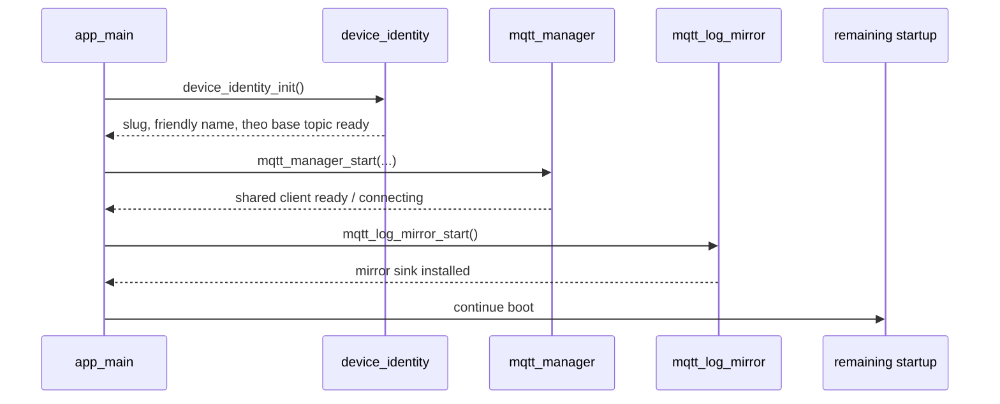

## Context

Today, log output is effectively local-only. The codebase uses normal `ESP_LOGx` calls throughout the firmware, and no repo code currently installs a custom `esp_log_set_vprintf()` sink. That means serial/UART output is the only built-in operational log path.

The current startup order matters:
1. `mqtt_manager_start()` runs in `main/app_main.c`
2. `mqtt_dataplane_start()` runs next
3. `env_sensors_start()` runs after that

At the same time, shared device identity is not owned in one place today:
- `env_sensors.c` derives and stores:
  - device slug
  - device friendly name
  - Theo base topic
- `mqtt_manager.c` independently derives and stores:
  - device slug
  - Theo base topic

That split ownership is already a maintenance problem, and it becomes a blocker for log mirroring because the desired MQTT log topic depends on slug/base-topic values that are currently not initialized early enough.

This feature is intentionally narrow. It is not a logging platform and it is not a telemetry redesign. It is a development aid for a wall-mounted device: keep serial logs exactly as they are today, and add a remote MQTT mirror of the same formatted line so the device can be observed without being taken off the wall.

### Terms used in this design
- **Device identity**: the shared normalized device slug, human-friendly device name, and Theo base topic.
- **Original sink**: the function pointer returned by `esp_log_set_vprintf()` before the mirror installs its own sink. In practice this preserves existing UART behavior.
- **Mirror sink**: the new custom sink that forwards to the original sink first, then attempts MQTT mirroring.
- **Best-effort logging**: remote publishing may fail or drop. Local UART output must still succeed.

## Third-Party Dependencies (Verified)

- **ESP-IDF toolchain in this workspace:** `ESP-IDF v5.5.2-249-gf56bea3d1f-dirty` (`idf.py --version`), using the local checkout at `/home/shyndman/dev/github.com/esp-idf/`.
  - Verified in `components/log/include/esp_log_write.h` that `esp_log_set_vprintf(vprintf_like_t func)` redirects the default UART0 log sink and returns the previous sink.
  - Verified in the same header that the callback **must be re-entrant** because it may be invoked in parallel from multiple task contexts.
- **ESP-MQTT component used by this project:** `espressif/mqtt` is declared in `main/idf_component.yml` and currently resolves to `1.0.0` in `dependencies.lock`.
  - Verified in Espressif's current `mqtt_client.h` docs/header that `esp_mqtt_client_enqueue()` stores the publish into the internal outbox and sends it later in the MQTT task context.
  - Verified that QoS 0 publishes are only enqueued this way when `store = true`.
  - Verified that `esp_mqtt_client_config_t.outbox.limit` is a byte limit, not a message-count limit.
  - Verified that `esp_mqtt_client_get_outbox_size()` is available if implementation-time debugging of outbox growth is needed.

These contracts are part of the design surface for this feature. The implementation should follow them exactly rather than inferring behavior from examples or memory.

## Goals / Non-Goals

**Goals:**
- Mirror each formatted application log line to a single topic: `<theo_base>/<device_slug>/logs`.
- Reuse the shared MQTT client already owned by `mqtt_manager`.
- Move shared identity ownership into one early-initialized module.
- Keep every existing `ESP_LOGx` call site unchanged.
- Preserve UART output exactly as the primary log path.
- Make failure behavior simple enough that a junior engineer can reason about it safely.

**Non-Goals:**
- No local persistence, replay buffer, or flash-backed history.
- No structured JSON logs.
- No per-level or per-tag topic fan-out.
- No second MQTT client.
- No fragment reassembly layer.
- No requirement to capture the earliest boot logs that occur before the mirror is installed.

## Decisions

### 1. Introduce a shared `device_identity` module
A new module will own all shared identity values used by MQTT publishers and diagnostics:
- normalized device slug
- device friendly name
- Theo base topic

This module should be initialized once, early in startup, before any code that needs topic naming.

Recommended public API:
- `esp_err_t device_identity_init(void);`
- `const char *device_identity_get_slug(void);`
- `const char *device_identity_get_friendly_name(void);`
- `const char *device_identity_get_theo_base_topic(void);`

Implementation expectations:
- Derive slug from `CONFIG_THEO_DEVICE_SLUG` using the same normalization rules already used by the repo.
- Use `"hallway"` as the fallback slug if normalization produces an empty string, matching existing behavior.
- Use `CONFIG_THEO_DEVICE_FRIENDLY_NAME` when present; otherwise derive the friendly name from the slug, matching existing behavior.
- Use `CONFIG_THEO_THEOSTAT_BASE_TOPIC` when present after trimming leading/trailing slashes; otherwise fall back to `"theostat"`, matching existing behavior.
- Store the results once and expose read-only accessors.

Why this is the right boundary:
- `mqtt_manager` currently starts before `env_sensors_start()`, so identity cannot continue to live only in `env_sensors`.
- The codebase already duplicates slug/base-topic logic across two modules.
- Friendly name is not duplicated today, but it is still part of the same conceptual identity and should move with the other identity fields.

Alternative considered:
- Keep identity in `env_sensors` and simply initialize that module earlier. Rejected because identity is not a sensor concern, and that would keep unrelated responsibilities coupled.

### 2. Cut over all existing identity consumers in one change
Once `device_identity` exists, all current consumers should read from it directly. Do not leave parallel getters in place long-term.

Known current consumers that should move:
- `mqtt_manager`
- `env_sensors`
- `device_info`
- `device_ip_publisher`
- `device_telemetry`
- `radar_presence`

Junior-engineer guidance:
- This is a full cutover, not an adapter migration.
- After the new module is wired in, delete old duplicated slug/base-topic storage from `mqtt_manager`.
- Remove shared identity ownership from `env_sensors`; that module should consume identity, not define it.
- Update comments/docstrings that currently say identity is only valid after `env_sensors_start()`.

### 3. Implement `mqtt_log_mirror` as a sibling module, not inside `mqtt_manager` or `mqtt_dataplane`
The new mirror should live as its own module with one job: mirror logs over the already-owned MQTT client.

Recommended public API:
- `esp_err_t mqtt_log_mirror_start(void);`

Responsibilities of `mqtt_log_mirror`:
- build the log topic from `device_identity`
- install the mirror sink with `esp_log_set_vprintf()`
- preserve the original sink for UART output
- attempt MQTT mirroring using the shared client
- never own broker lifecycle or subscription logic

Why this separation matters:
- `mqtt_manager` owns connection lifecycle and readiness state.
- `mqtt_dataplane` owns inbound topics, reassembly, and command/state flow.
- Log mirroring is observability. It should be easy to remove or disable without rewriting connection management.

Alternative considered:
- put the sink logic directly in `mqtt_manager`. Rejected because it mixes connection ownership with an optional development feature.

### 4. Install the mirror after identity is initialized and after `mqtt_manager_start()` succeeds
The mirror does not need to capture the very first boot logs. The goal is to make later operational logs visible remotely.

Recommended startup sequence in `app_main`:
1. initialize `device_identity`
2. start `mqtt_manager`
3. start `mqtt_log_mirror`
4. continue with `mqtt_dataplane`, `env_sensors`, and the rest of boot

Why this sequence:
- the mirror needs both the topic name and the shared MQTT client to exist
- placing the mirror before the rest of boot increases the amount of useful startup logging that gets mirrored without forcing us to solve earliest-boot capture



### 5. Preserve UART as the canonical sink and mirror second
The custom sink must forward to the original sink first. Local output wins over remote output.

Required behavior:
1. receive the formatted line from ESP-IDF
2. immediately call the preserved original sink with the same line/arguments
3. try to mirror remotely after local output is already handed off

This ordering is important because the feature is only a convenience layer. It must never weaken the existing serial logging path.

Third-party API constraint:
- ESP-IDF's `esp_log_set_vprintf()` contract requires the installed callback to be re-entrant.
- The mirror sink therefore must not assume single-threaded use.
- Do not use one shared mutable formatting buffer unless it is protected in a way that still satisfies the callback contract.
- Prefer stack-local state or another concurrency-safe approach when formatting the mirrored payload.

### 6. Use `esp_mqtt_client_enqueue()` with the shared client outbox
The design intentionally does not add an app-owned queue or publisher task. It relies on the buffering already present in esp-mqtt.

Required publish behavior:
- get the shared client with `mqtt_manager_get_client()`
- check `mqtt_manager_is_ready()` before attempting remote publish
- if the client is unavailable or not ready, skip remote publish and return after local UART output
- enqueue the log line with `esp_mqtt_client_enqueue()`
- use a single log topic: `<theo_base>/<device_slug>/logs`
- use QoS 0 and `retain = false`
- pass `store = true` so QoS 0 messages are actually queued in the esp-mqtt outbox

Why the readiness check is explicit:
- the feature is best-effort
- blind spots during disconnects are acceptable
- skipping remote publish while disconnected is simpler and safer than trying to build an offline log backlog

Junior-engineer guidance:
- `esp_mqtt_client_enqueue()` is the non-blocking path.
- `store = true` is a non-obvious detail for QoS 0. Without it, QoS 0 messages are not queued in the way this design expects.
- Do not switch to `esp_mqtt_client_publish()` unless the spec changes.

### 7. Never call `ESP_LOGx` from the mirror sink
This is the single most important safety rule in the implementation.

Why:
- the sink sits underneath `ESP_LOGx`
- if the sink calls `ESP_LOGW`/`ESP_LOGE`, that new log will come back through the same sink
- that can create recursion or a feedback loop during failures

Allowed failure behavior:
- if `mqtt_manager_is_ready()` is false, do nothing remotely
- if `esp_mqtt_client_enqueue()` fails, write a warning directly through the preserved original sink only
- do not attempt to create a secondary logging framework

Pseudocode for the intended sink behavior:

```python
def mirror_vprintf(fmt, args):
    original_result = original_sink(fmt, args)

    if not mqtt_manager_is_ready():
        return original_result

    client = mqtt_manager_get_client()
    if client is None:
        return original_result

    line = format_current_log_call(fmt, args)
    result = esp_mqtt_client_enqueue(client, log_topic, line, 0, 0, False, True)
    if result < 0:
        original_sink("W (...) mqtt_log_mirror: remote log enqueue failed\n")

    return original_result
```

The pseudocode is illustrative only. The final C implementation must handle `va_list` use correctly and must not attempt to reuse a consumed `va_list` without copying it safely.

### 8. Bound outbox growth explicitly in `mqtt_manager`
The log mirror is development-focused and best-effort. It must not be allowed to grow memory use without limit.

Implementation expectation:
- configure an explicit shared MQTT outbox limit when building the MQTT client configuration in `mqtt_manager`
- set this via `esp_mqtt_client_config_t.outbox.limit`, which esp-mqtt defines as a size limit in bytes
- document the chosen limit inline so future maintainers know it exists partly because of log mirroring

This is a shared-client setting, so the engineer must think about the effect on existing publishers too. The limit should be large enough for normal diagnostics traffic but still bounded.

## Risks / Trade-offs

- [Identity cutover leaves two sources of truth] → Remove old ownership in the same change; do not leave compatibility wrappers behind.
- [Mirror is installed too early] → Only install it after both `device_identity_init()` and `mqtt_manager_start()` succeed.
- [Mirror is installed too late] → Install it immediately after `mqtt_manager_start()` so most remaining boot logs are mirrored.
- [Remote publish path causes recursion] → Never use `ESP_LOGx` inside the sink; only use the preserved original sink for warning output.
- [MQTT disconnects create blind spots] → Accept that trade-off explicitly; this feature is for convenience, not guaranteed delivery.
- [Unbounded buffering] → Set a shared outbox limit in `mqtt_manager` and skip remote publish when the client is not ready.
- [Junior engineer forgets to update comments/docs] → Treat docstring/comment cleanup as part of the identity cutover task, not optional polish.

## Migration Plan

1. Create `device_identity` with init/accessor APIs and wire it into `app_main` before MQTT startup.
2. Cut over identity consumers one module at a time until all readers use `device_identity`.
3. Delete old duplicated identity storage and derivation from `mqtt_manager` and shared-identity ownership from `env_sensors`.
4. Add `mqtt_log_mirror`, wire its startup immediately after `mqtt_manager_start()`, and build the log topic from `device_identity`.
5. Install the custom sink and mirror logs with `esp_mqtt_client_enqueue()`.
6. Add a bounded outbox limit in `mqtt_manager`.
7. Verify build success, then verify on hardware that UART and MQTT both show later boot/runtime logs.

Rollback strategy:
- if the mirror itself proves unstable, disable only `mqtt_log_mirror_start()` first
- keep the `device_identity` refactor unless it is independently broken, because consolidating shared identity ownership is a valid cleanup on its own

## Open Questions

- None. Current design decisions are locked.
