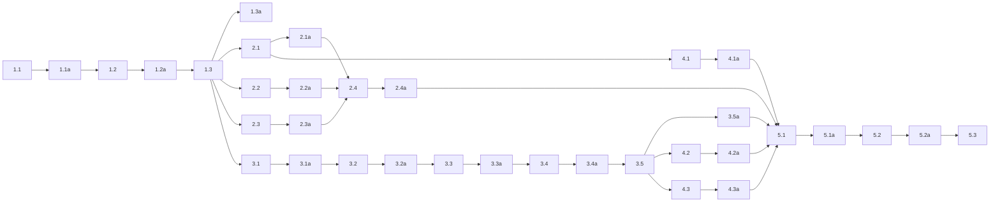

## 1. Shared device identity
- [x] 1.1 Create a new `device_identity` module with one init function and read-only accessors for slug, friendly name, and Theo base topic.
- [x] 1.1a Validate with `idf.py build` that the new module compiles and links before any consumers are cut over.
- [x] 1.2 Move the existing slug/friendly-name/base-topic derivation rules into `device_identity`, preserving today’s fallback behavior (`hallway`, derived friendly name, `theostat`).
- [x] 1.2a Validate by code inspection that the new module implements the same normalization and fallback behavior currently used in the repo.
- [x] 1.3 Initialize `device_identity` in `main/app_main.c` before `mqtt_manager_start()` and fail boot if identity initialization fails.
- [x] 1.3a Validate with a build and source inspection that `device_identity_init()` runs before both `mqtt_manager_start()` and `mqtt_dataplane_start()`.

## 2. Identity consumer cutover
- [x] 2.1 Update `mqtt_manager` to read slug/base-topic from `device_identity` and remove its private copies of those fields.
- [x] 2.1a Validate by inspection that `mqtt_manager.c` no longer derives or stores its own slug/base-topic values.
- [x] 2.2 Update `env_sensors` to consume `device_identity` instead of owning shared slug/friendly-name/base-topic state.
- [x] 2.2a Validate by inspection that `env_sensors` no longer documents identity as becoming valid only after `env_sensors_start()`.
- [x] 2.3 Update `device_info`, `device_ip_publisher`, `device_telemetry`, and `radar_presence` to consume `device_identity` directly.
- [x] 2.3a Validate with search results or code inspection that those modules no longer call `env_sensors_get_device_slug()`, `env_sensors_get_device_friendly_name()`, or `env_sensors_get_theo_base_topic()`.
- [x] 2.4 Remove obsolete shared-identity helpers, comments, and storage so there is exactly one source of truth.
- [x] 2.4a Validate with a clean build plus targeted search that only `device_identity` owns shared slug/friendly-name/base-topic derivation.

## 3. MQTT log mirror module
- [x] 3.1 Create `mqtt_log_mirror` as a dedicated module with a startup API and a cached `<theo_base>/<device_slug>/logs` topic built from `device_identity`.
- [x] 3.1a Validate by inspection that the log topic format is exactly `<theo_base>/<device_slug>/logs`.
- [x] 3.2 Install a custom `esp_log_set_vprintf()` sink that preserves the original sink pointer and forwards to the original sink first.
- [x] 3.2a Validate by inspection that the sink always calls the original sink before any MQTT work.
- [x] 3.2b Validate by inspection that the sink implementation is re-entrant-safe per the ESP-IDF callback contract and does not rely on a single unsynchronized shared formatting buffer.
- [x] 3.3 In the custom sink, obtain the shared client through `mqtt_manager_get_client()`, check `mqtt_manager_is_ready()`, and use `esp_mqtt_client_enqueue()` for remote mirroring.
- [x] 3.3a Validate by inspection that the implementation uses `esp_mqtt_client_enqueue()` rather than `esp_mqtt_client_publish()`.
- [x] 3.4 Ensure the enqueue call uses QoS 0, `retain = false`, and `store = true` so QoS 0 log lines are actually queued through esp-mqtt.
- [x] 3.4a Validate by inspection that the enqueue arguments match the design exactly.
- [x] 3.5 Start `mqtt_log_mirror` in `app_main` immediately after `mqtt_manager_start()` succeeds and before the rest of boot continues.
- [x] 3.5a Validate with build output and source inspection that the mirror starts after MQTT manager startup but before later boot-stage modules.

## 4. Failure handling and bounded buffering
- [x] 4.1 Configure a bounded shared MQTT outbox limit in `mqtt_manager` and document why it exists.
- [x] 4.1a Validate by inspection that the outbox limit is set via `esp_mqtt_client_config_t.outbox.limit` (bytes) rather than in a separate app-owned queue.
- [x] 4.2 Make the mirror a no-op for remote publishing when the shared client is missing or not ready.
- [x] 4.2a Validate by inspection that the sink returns after local logging when MQTT is unavailable.
- [x] 4.3 On enqueue failure, emit a warning only through the preserved original sink and never through `ESP_LOGx`.
- [x] 4.3a Validate with targeted search/code inspection that `mqtt_log_mirror` does not call `ESP_LOGI/W/E/D/V` from the sink or failure path.

## 5. Verification
- [x] 5.1 Run a full firmware build after all code changes and capture the build output artifact.
- [x] 5.1a Validate that the build passes without adding lint-disable directives or compatibility shims.
- [ ] 5.2 (HUMAN_REQUIRED) Flash or boot the firmware on hardware, subscribe to `<theo_base>/<device_slug>/logs`, and confirm that later boot/runtime UART log lines also appear over MQTT.
- [ ] 5.2a (HUMAN_REQUIRED) Confirm that normal diagnostics publishers still use the expected device identity values after the cutover.
- [ ] 5.3 (HUMAN_REQUIRED) Force an MQTT disconnect or enqueue failure condition and confirm the device stays stable, UART remains readable, and no recursive logging loop appears.

