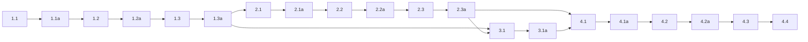

## 1. Speaker ownership foundation
- [ ] 1.1 Create a new app-level speaker abstraction module, preferably in `main/thermostat/`, that becomes the only owner of speaker-busy policy. It should wrap the existing `thermostat_audio_driver_*` API, expose one entrypoint for one-shot cue playback, and expose streamed entrypoints for remote PCM frames and remote-stream lease release.
- [ ] 1.1a Validate with `idf.py build` that the new speaker module compiles and links cleanly into the existing firmware.
- [ ] 1.2 Cut over `main/thermostat/audio_boot.c` and any other one-shot cue callers so they call the new speaker abstraction instead of `thermostat_audio_driver_play()` directly. Preserve existing volume-prepare behavior and existing cue policy checks.
- [ ] 1.2a Validate by code inspection and targeted search that application cue playback no longer bypasses the speaker abstraction and that `audio_boot.c` no longer writes PCM directly to the audio driver.
- [ ] 1.3 Implement remote-stream ownership policy inside the speaker abstraction: accept mono PCM16 16 kHz frames, suppress one-shot cues while a remote stream lease is active, release after 1 second of remote-audio inactivity, and release immediately on explicit WebRTC session stop.
- [ ] 1.3a Validate by code inspection that the inactivity timer, lease state, and immediate-release path all live in the speaker abstraction rather than `webrtc_stream.c` or `audio_boot.c`.

## 2. WebRTC receive-audio pipeline
- [ ] 2.1 Add an `av_render`-backed talkback player path, likely in a small helper module near `main/streaming/`, with a custom `audio_render_ops_t` sink. The sink should receive decoded PCM from `av_render` and forward it into the speaker abstraction. Do not use `av_render_alloc_i2s_render()`.
- [ ] 2.1a Validate with source inspection that the player path hands PCM to the speaker abstraction, implements the required custom sink callbacks, and does not open the speaker through `av_render_alloc_i2s_render()` or `esp_codec_dev_open()`.
- [ ] 2.2 Update `main/streaming/webrtc_stream.c` to create and own the player handle, pass both `capture` and `player` through `esp_webrtc_set_media_provider()`, change audio direction to `ESP_PEER_MEDIA_DIR_SEND_RECV`, keep video `ESP_PEER_MEDIA_DIR_SEND_ONLY`, preserve current camera/uplink-mic behavior when talkback is absent, and wire immediate remote-stream release from an internal disconnect/stop path because no public per-session teardown hook exists today.
- [ ] 2.2a Validate with `idf.py build` and code inspection that `webrtc_stream.c` no longer configures the session as uplink-only audio, that `capture` remains non-NULL in the media provider, and that immediate release is triggered from an internal disconnect/stop seam rather than an external poller.
- [ ] 2.3 Implement supported-format gating and downlink-fallback behavior so unsupported peer audio is logged and ignored for playback while the rest of the WebRTC session stays up. The accepted product contract is Opus / 16 kHz / mono for talkback playback.
- [ ] 2.3a Validate by code inspection that unsupported receive audio does not tear down camera or uplink microphone streaming and that the rejection path only disables talkback playback.

## 3. Talkback observability
- [ ] 3.1 Add structured logs for talkback capability advertisement, supported/unsupported remote audio parameters, first-playable-frame activation, idle timeout, explicit session-end release, cue suppression, and speaker-open/close failures. Keep logs at transition points and include enough fields to explain why playback was accepted, rejected, opened, idled, or closed.
- [ ] 3.1a Validate by code inspection and targeted search that talkback logging is transition-based, includes rejection reasons and lifecycle transitions, and does not log every audio frame.

## 4. Verification
- [ ] 4.1 Run a full firmware build after the implementation changes and capture the build output artifact.
- [ ] 4.1a Validate that the build passes without adding compatibility shims or lint-disable directives.
- [ ] 4.2 (HUMAN_REQUIRED) Connect one WebRTC peer, confirm the thermostat still streams camera and microphone uplink, and confirm peer talkback audio plays immediately through the local speaker with no UI/LED state change.
- [ ] 4.2a (HUMAN_REQUIRED) While remote talkback is active, trigger a local cue path and confirm it is suppressed; then stop peer audio without disconnecting and confirm the speaker becomes available again after the 1 second idle window or immediately on session close.
- [ ] 4.3 (HUMAN_REQUIRED) Offer an unsupported receive-audio configuration and confirm the session remains usable for camera/uplink mic while downlink talkback stays unavailable and the rejection reason is visible in logs.
- [ ] 4.4 (HUMAN_REQUIRED) Attempt a second concurrent peer/session and confirm the existing single-session gate still rejects it while the active peer keeps ownership of talkback.

